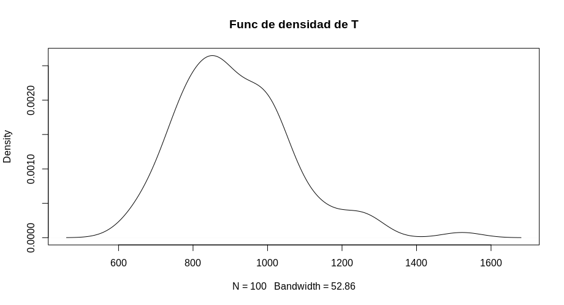
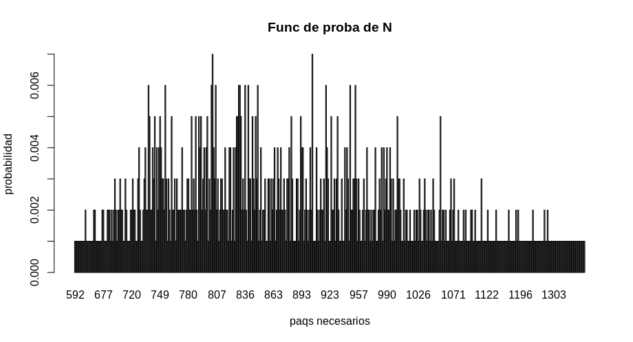

This is my first program using R. This is an exercise made for the probability course. It simulates the generation of a pack with a ceritain number stickers in it and a certain number of total amount of stickers necesary to complete the album, a function that simulates the filling of an album if the distribution of the stickers is random and returns how many packs are neccesary and  finally estimates the graph of the probability functions and expeted values of 4 variables :
- N  as the number of packs needed to complete the album
- C  the amount of money required to 	complete the album
- T  the time required to complete the album
- X  the time (in days) between two consecutive purchases of packs (which is known to have an exponential distribution with a rate  of 1)

 

 
 

